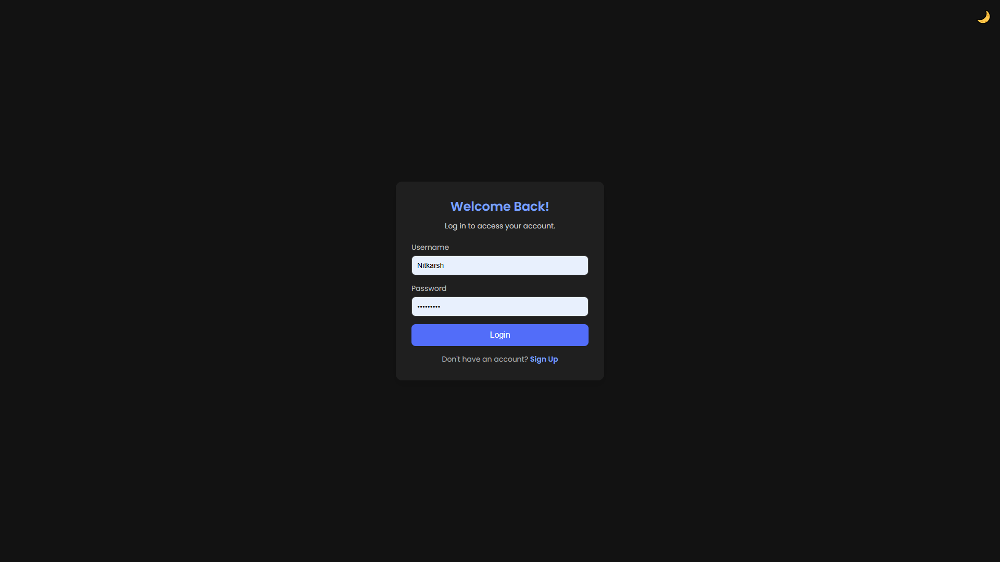
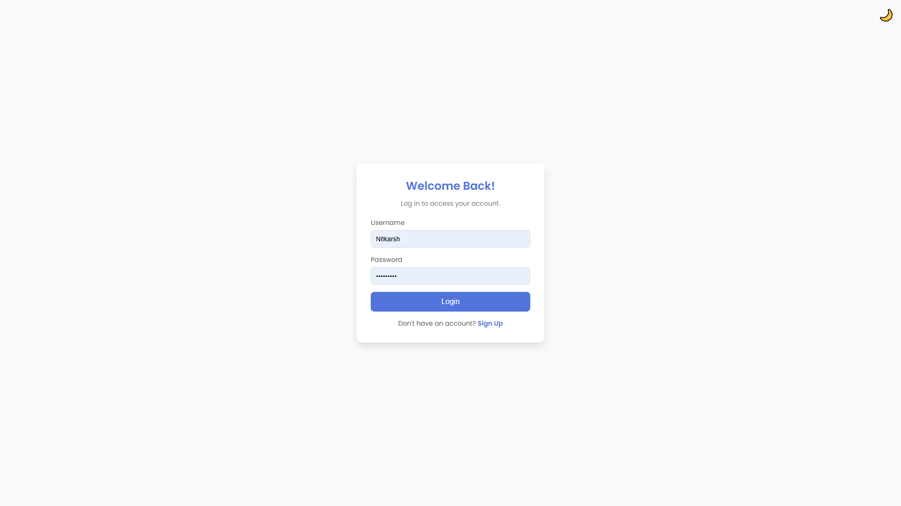
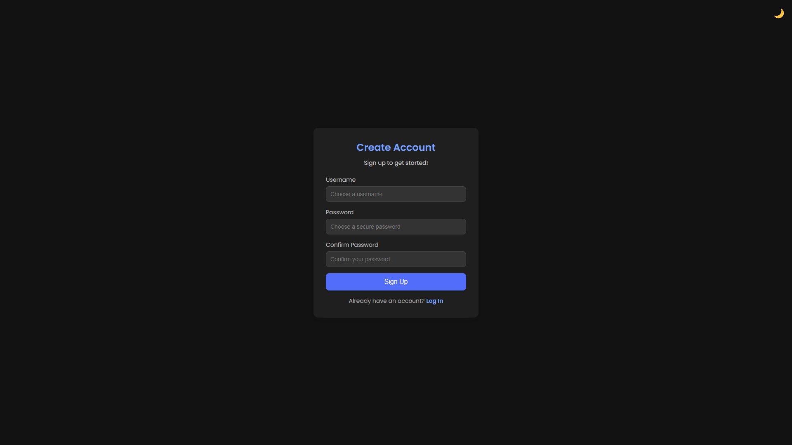
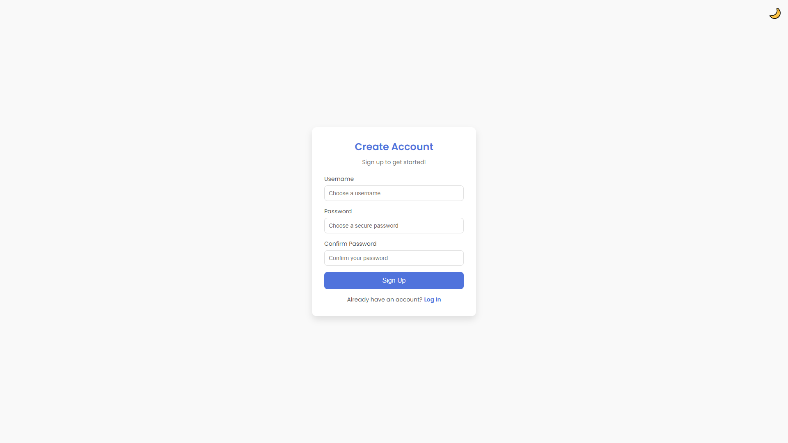
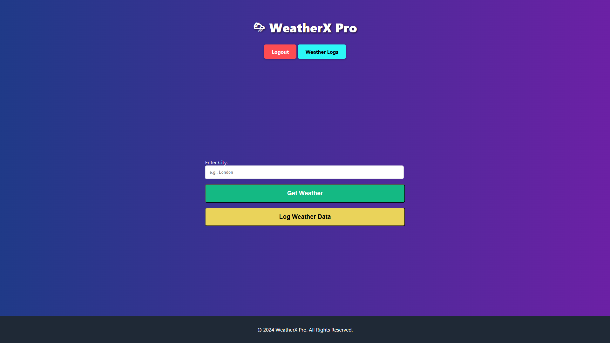
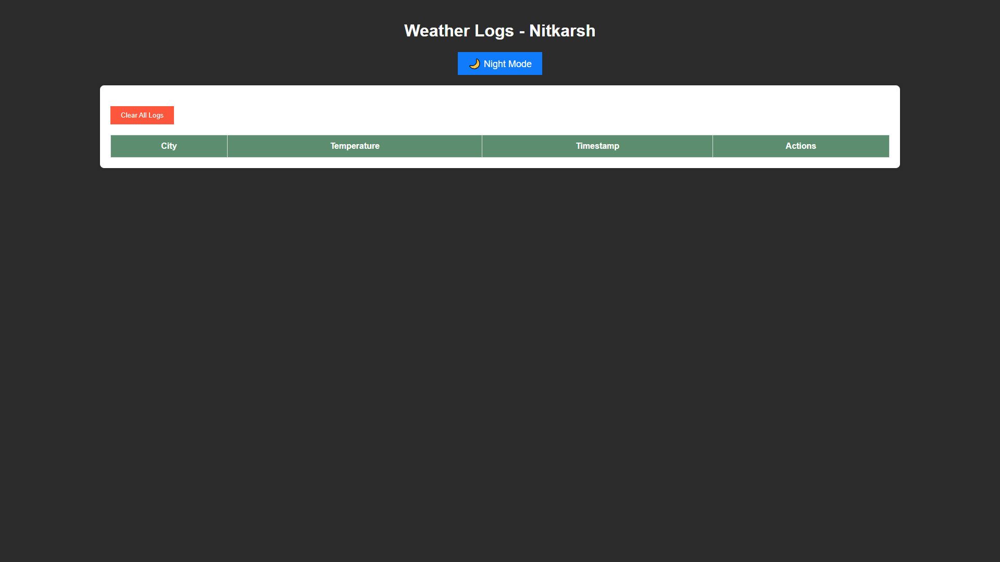
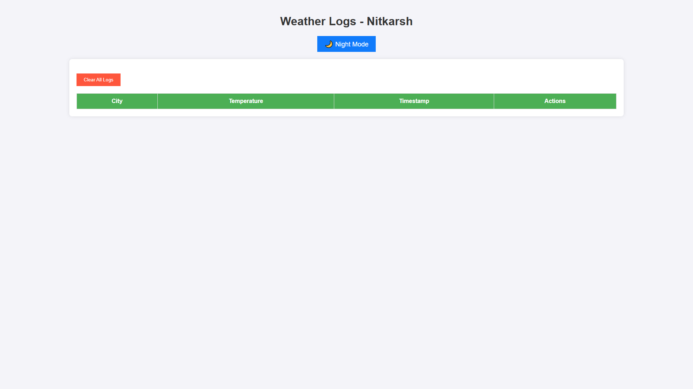

# **Weather App Assignment 🌦️**

[](LICENSE)

This is a Python-based web application that allows users to retrieve, log, and manage weather data. It features secure user authentication, real-time weather data retrieval using the OpenWeather API, and persistent logging with a PostgreSQL database.

---

### **Screenshots: A Visual Tour of the App** 🖼️

#### **1. Login Page - Night Mode**



#### **2. Login Page - Day Mode**



---

#### **3. Registration Page - Night Mode**



#### **4. Registration Page - Day Mode**



---

#### **5. Dashboard**



---

#### **6. Weather Logs Page - Night Mode**



#### **7. Weather Logs Page - Day Mode**



---

## **Key Features** 🚀

1. **Real-Time Weather Data Retrieval**

   - Fetches weather data using the [OpenWeather API](https://openweathermap.org/current) for any city.
   - Displays key details:
     - **Temperature** (Celsius or Fahrenheit)
     - **Pressure**
     - **Humidity**
     - **Wind Speed and Direction**
   - Auto-refreshes weather data every 2 seconds.

2. **User Authentication**

   - Secure login based on credentials stored in a JSON file.
   - Passwords hashed for secure storage and validation.
   - Only authenticated users can access the app's features.

3. **Weather Logging**

   - Log the displayed weather data with a single click.
   - Persistent storage using PostgreSQL, ensuring user-specific logs are saved.
   - View logged data in a structured table or card view.
   - Ability to delete individual logs.

4. **Enhanced Security**

   - CSRF protection and secure cookie management.
   - API keys securely managed to prevent exposure.

5. **User Experience Enhancements**

   - Night mode for better readability in low-light conditions.
   - Auto-logout after inactivity for enhanced security.
   - Auto-refresh feature every 10 minutes for selected locations.

6. **Optional AWS Integration** (Challenge)
   - Serverless backend using AWS Lambda and API Gateway for storing weather logs in DynamoDB.

---

## **Technologies Used** 🛠️

### **Backend**

- **Python**: Flask for server-side development.
- **PostgreSQL**: For persistent and scalable database storage.
- **SQLAlchemy**: ORM for seamless database integration.

### **Frontend**

- **HTML**, **CSS**, and **JavaScript**: Core frontend technologies.
- **Bootstrap**: For responsive and modern design.

### **Third-Party Services**

- **OpenWeather API**: For fetching real-time weather data.
- **AWS Lambda & DynamoDB** _(optional)_: For cloud-based data storage.

### **Tools**

- **Docker**: Containerization for ease of deployment.
- **Vercel**: Hosting and deployment.

---

## **Setup and Installation** 🛠️

1. **Clone the Repository**

   ```bash
   git clone https://github.com/NitkarshChourasia/weather_app_assignment.git
   cd weather_app_assignment
   ```

2. **Set Up the Environment**

   - Create a `.env` file for sensitive credentials (refer to `.env.example`):
     ```plaintext
     API_KEY=your_openweather_api_key
     DATABASE_URL=your_postgresql_database_url
     SECRET_KEY=your_flask_secret_key
     ```

3. **Install Dependencies**

   ```bash
   pip install -r requirements.txt
   ```

4. **Run the Application**

   ```bash
   flask run
   ```

5. **Access the App**  
   Navigate to [http://localhost:5000](http://localhost:5000) in your browser.

---
